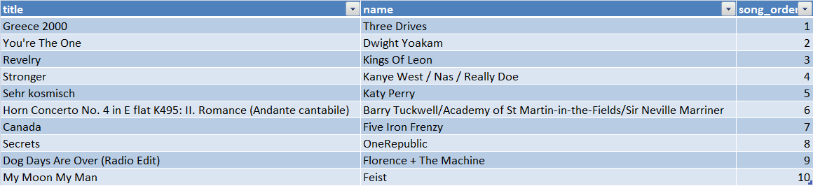

## **Database purpose:**
A startup called Sparkify has an application which provides songs streaming 
capability for the users. The app produce json logs, which contain the 
user activities on the app. The startup wants to understand their users by
analyzing these logs and perform various queries on them easily. 
One of their goals to know what songs are being listened by their users.

## **Database Schema:**
 

 The above image contains the following tables:

- Staging schema:
  - EVENTS: This table is used to stage the logs files.
  - SONGS: This table is used to stage the songs files

- Model schema:
        
     - SONGPLAYS: This table is the main table. It contains song playing 
       transactions generated by the app according to what song has been 
       choosen and played by the user.
       The following are the columns and their description:
       - START_TIME: The timestamp in millisecond for the transaction.
       - USER_ID: The user id for the user who generated this transaction.
         It is a foreign key from the USERS table.
       - LEVEL: The type of the user either free or paid. It holds the 
         level of the user at the timestamp of this transaction.  
       - SONG_ID: The id of the song which has been played by the user.
         It is a foreign key from the SONGS table.
       - ARTIST_ID: The is of the artist for the song played.
         It is a foreign key from ARTISTS table.
       - SESSION_ID: Id for the web session which user was using and resulted
         in generating this transaction.
       - USER_AGENT: text which specify the OS type and version and browser     
         version and type.
    
    - ARTISTS: A table which holds list of artists and any information
      related to them.
      The following are the columns and their description:
      - ARTIST_ID: Unique id for the artist in this table.
      - NAME: Name of the artist.
      - LOCATION: The location of the artist geographically.
      - LATITUDE: The latitude of for the artist location. 
      - LONGITUDE: The longitude of the artist location.
    
    - SONGS: This table holds list of songs and any information related to them.
      The following are the columns and their description:
      - SONG_ID: Unique id for the song in thi table.
      - TITLE: The title of name of the song.
      - ARTIST_ID: The id of the artist of this song.
        It is a foreign key from ARTISTS table.
      - YEAR: The production year of this song. 
      - DURATION: The playing duration of the song.
    
    - TIME: It is a table for all the timestamps appeared in the transactions 
      loaded in the SONGPLAYS table. It contains addition columns
      derived from the timestamp column itself. These can be used to get 
      insights on different levels (hour,day,week,weekday,month,year).
      
    - USERS: This table holds all the users who caused in generating any song 
      playing transaction.
      The following are the columns and their description:
      - USER_ID: Unique Id for the user in the table.
      - FIRST_NAME:The first name for the user.
      - LAST_NAME: The last name for the user.
      - GENDER: the gender of the user(M:male,F:female)
      - LEVEL: The type of the user either free or paid. This column holds the
        latest level for the user appeared into the last log file loaded.
 

## **Files and description**
 - **[create_tables.py](/create_tables.py)**: It creates the two schemas: Staging and Model. Then, it creates
the staging tables: Events and Songs. It creates also the model tables: USERS,SONGPLAYS,SONGS,TIME and ARTISTS. 
 
 - **[sql_queries.py](/sql_queries.py)**: This python script contains all the queries
which are related to creating or dropping the tables mentioned above.It contains the copy commands 
which are used to stage the songs logs files in the staging tables. It also contains the 
insert statements which are used in populating model tables from the staging tables. The insert
statements have been written in a way to remove duplicates. Also, an update statements have   
been added to be able to simulate upsert capability for each of the model tables.

 - **[etl.py](/etl.py)**: It runs the whole ETL process. It runs the staging commands. After the
   staging process it runs the insret statements which populate the model tables.
 - **[dwh.cfg](/dwh.cfg)**: This file contains any properties needed to connect to the cluster.
It also contains the path of the files to be loaded from S3.

## **Sequence of execution**
 1- Execute create_tables.py to create the schemas and the required tables.

 2- Execute etl.py to stage the logs and songs files which reside in the S3.
    After the staging process is finalized, the process which populate the model tables is 
    executed.

## **Sample Queries:**
- Getting a trend line for the total usage per hour.
  
  - **Query:** 
    
        select t."hour" ,count(*) cnt 
        from MODEL.songplays s 
        inner join MODEL."time" t 
        on s.start_time =t.start_time 
        group by t."hour" ;
  - **Results:**
  From the graph below the peak hour is 4:00 PM
    
 
- Getting top 10 songs with their artists names
  - **Query:**
    
        select title,"name",row_number()OVER(order by cnt desc) SONG_ORDER
        from 
        (
            select s2.title , a."name" ,count(*) cnt 
            from MODEL.songplays s 
            inner join MODEL.songs s2 
            on s.song_id = s2.song_id
            inner join model.artists a 
            on a.artist_id = s.artist_id 
            group by s2.title,a."name" 
            order by cnt desc limit 10
        ) X;
    
  - **Results:**
  The results as in the in below image:
    
        
   
